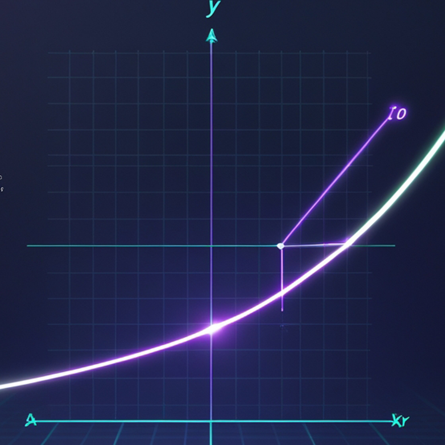

# -MathVerse-An-Interactive-Suite-of-Mathematical-Web-Applications
**MathVerse** is a comprehensive collection of powerful, interactive, and beautifully designed web applications built to make complex mathematical concepts intuitive and engaging.

# MathVerse: An Interactive Suite of Mathematical Web Applications


## Description

**MathVerse** is a comprehensive collection of powerful, interactive, and beautifully designed web applications built to make complex mathematical concepts intuitive and engaging. From advanced calculus and probability simulation to trigonometric analysis, each tool is crafted to be a feature-complete and enjoyable experience for students, educators, and enthusiasts.

This project is built with vanilla JavaScript, modern CSS, and a suite of powerful open-source libraries to deliver a seamless and performant user experience directly in the browser.

### Live Demo

**[🚀 Launch MathVerse Hub](https://sadeepas.github.io/MathVerse/mathsweb.html)**

---

## 🏛️ The Applications

The MathVerse suite includes four main, feature-rich applications, all accessible from a central hub.

*(Placeholder for a GIF showcasing the main hub and switching between apps)*

### 1. 🎲 Ultimate Dice Lab

A professional-grade probability and statistics simulator designed for students, gamers, and developers.


**Key Features:**
-   **Customizable Rolls**: Select dice type (d4-d20), number of dice (up to 5), and visual themes (Classic, Neon, Metallic).
-   **3D Dice Animations**: Realistic, physics-based 3D animations for dice rolls.
-   **Advanced Statistics**: Real-time calculation of Trials, Mean, and Mode.
-   **🎲 Chi-Squared (χ²) Fairness Test**: Automatically tests if the dice results align with pure probability after 100+ trials.
-   **🎰 Casino Mode**: Bet on outcomes like sum, odd/even, or high/low with a persistent balance.
-   **High-Speed Simulation**: Run thousands of trials in seconds to quickly generate large datasets.
-   **Data Portability**: Export frequency data to CSV or save/load the entire application state as a JSON file.

---

### 2. 📈 Aura Graph Plotter

An advanced multi-mode graphing calculator that transforms complex equations into clear, dynamic visuals.


**Key Features:**
-   **Multi-Mode Plotting**: Switch seamlessly between **Standard (Cartesian)**, **Polar**, and **Transformation** plotting modes.
-   **Intersection Finder**: Automatically finds and plots the intersection points of two functions.
-   **Calculus Analysis**: Instantly plot the symbolic **derivative** or **integral** of a function.
-   **Interactive Canvas**: Smooth pan and zoom functionality powered by `chartjs-plugin-zoom`.
-   **Function Transformation**: Use interactive sliders to visualize how parameters `a, b, c, d` in `g(x) = a * f(b * (x - c)) + d` affect a base function.
-   **Detailed Analysis**: Automatically find roots, extrema, and calculate the area under the curve.

---

### 3. 📐 Trigonometric PRO

An all-in-one suite of powerful, interactive tools designed to master trigonometry.


**Key Features:**
-   **🧮 Symbolic Calculator**: Solves complex trigonometric expressions and equations.
-   **🔺 Interactive Triangle Solver**: Solves any triangle given 3 values (SSS, SAS, AAS) and provides a dynamic SVG visualization.
-   **〰️ Wave Simulator**: An interactive lab to explore wave properties. Visualize the interference and summation of two independent sine/cosine waves with real-time controls for amplitude, frequency, and phase shift.
-   **🔍 Identity Verifier**: Checks if a given trigonometric equation is an identity by testing it with numerous random values.
-   **🌐 Multilingual Support**: Fully functional in both English and Sinhala (සිංහල).

---

### 4. 🧠 Calculus Odyssey

A complete web-based toolkit that makes calculus clear and interactive, from symbolic calculations to visual analysis.



**Key Features:**
-   **➗ Symbolic Calculator**: A powerful engine to evaluate, simplify, differentiate, integrate, and solve expressions.
-   **🔢 Matrix Calculator**: Perform common matrix operations like finding the determinant, inverse, transpose, and eigenvalues.
-   **🎨 Interactive Graphing Lab**: A sophisticated graphing canvas to plot Cartesian, Parametric, and Polar functions.
-   **🔬 Live Analysis Tools**:
    -   Visualize the **tangent line** by hovering over a curve.
    -   Automatically find and plot **critical points** (maxima/minima).
    -   Visualize **definite integrals** and calculate the area under the curve.
    -   Animate **Newton's Method** for finding roots.
-   **🧪 Practice Lab**: Sharpen your skills with randomly generated derivative and integral problems with instant feedback.

---

## 🛠️ Technology Stack

-   **Frontend**: HTML5, CSS3, Vanilla JavaScript (ES6+)
-   **Styling**:
    -   **Tailwind CSS**: For modern, utility-first styling.
    -   **Pure CSS**: Extensive use of CSS Variables for theming, custom animations, and responsive design.
-   **Core Libraries**:
    -   **[Math.js](https://mathjs.org/)**: For symbolic mathematics, including derivatives, integrals, and matrix operations.
    -   **[Chart.js](https://www.chartjs.org/)**: For creating beautiful, interactive, and performant graphs and charts.
    -   **[Three.js](https://threejs.org/)**: Used for the 3D rendering in the loading animation of Trigonometric PRO.

---

## 🚀 How to Use

No installation is required! This is a suite of static web pages.

1.  Clone or download the repository.
2.  Open the `mathsweb.html` file in any modern web browser to launch the main hub.
3.  From the hub, you can navigate to any of the other applications.

For the best experience (especially for features involving data import/export), it is recommended to run the files using a simple local server.

---

## 📂 Project Structure

```
/
├── mathsweb.html      # The main landing page/hub for all applications
├── dice.html          # The Ultimate Dice Lab application
├── plotter.html       # The Aura Graph Plotter application
├── trigo.html         # The Trigonometric PRO application
├── calculas.html      # The Calculus Odyssey application
├── *.jpg / *.png      # Image assets used in the applications
└── README.md          # This file
```

---

## ✍️ Author

**Sadeepa Lakshan**

-   **GitHub**: [@sadeepas](https://github.com/sadeepas)
-   **LinkedIn**: [Sadeepa Lakshan](https://www.linkedin.com/in/sadeepa-lakshan/)
-   **Email**: `sadeepapemasiri2@gmail.com`

---

## 📜 License

This project is licensed under the MIT License. See the [LICENSE](LICENSE) file for details.
